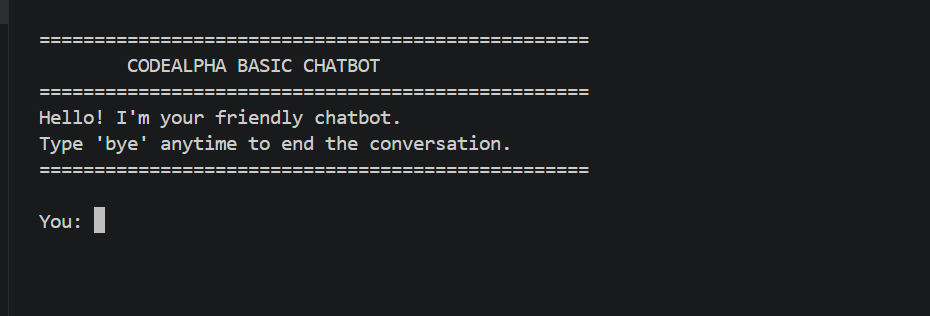
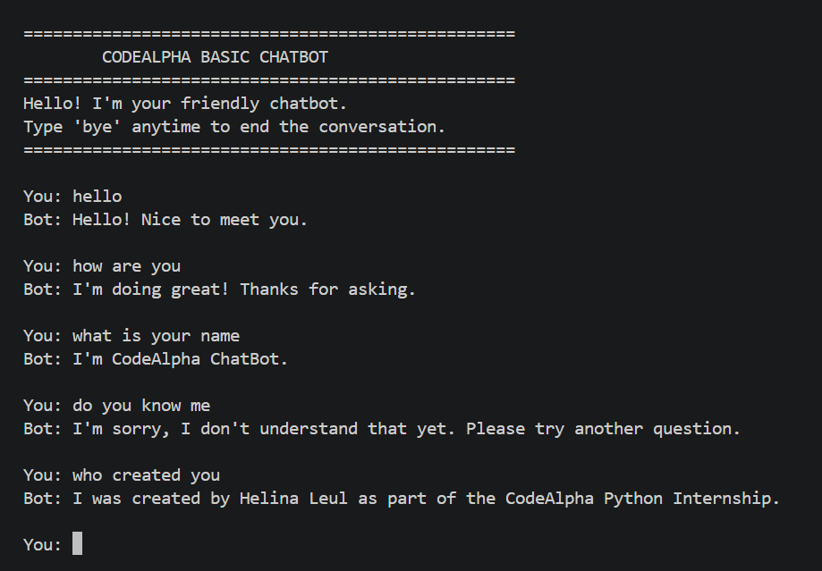
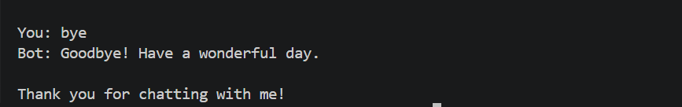

# 🤖 Basic Chatbot

A console-based **rule-based chatbot** developed in **Python** as part of the **CodeAlpha Python Programming Internship**. This project demonstrates Python fundamentals, functions, loops, conditional logic, user input handling, modular programming, and file handling through the implementation of an interactive chatbot system.

---

## 📖 Project Overview

The Basic Chatbot is a simple text-based conversational program that interacts with users through predefined responses.

The chatbot accepts user messages, analyzes the input, and provides appropriate responses based on a predefined response database. It supports basic conversations such as greetings, asking about its identity, checking available capabilities, and ending conversations.

This project was designed using clean coding practices with a modular structure by separating chatbot responses into an independent Python file and storing conversation history in a text file.

---

## ✨ Features

* 🤖 Interactive console-based conversation
* 👋 Greeting and farewell messages
* 💬 Predefined rule-based responses
* 🔍 User input normalization
* ❓ Handles unknown questions gracefully
* 📝 Saves complete chat history automatically
* 🕒 Records conversation date and time
* 🧩 Modular code organization
* 📚 Clean and documented Python code

---

## 🛠️ Technologies Used

* Python 3
* Git
* GitHub
* Visual Studio Code

---

## 📂 Project Structure

```text
CodeAlpha_Basic_Chatbot/
│
├── screenshots/
│   ├── start.png
│   ├── conversation.png
│   └── goodbye.png
│
├── .gitignore
├── LICENSE
├── README.md
├── requirements.txt
├── chatbot.py
├── responses.py
└── chat_history.txt
```

---

# 🚀 Getting Started

## Prerequisites

Make sure you have:

* Python 3.x installed
* Git installed (optional, for cloning)

---

## Clone the Repository

```bash
git clone https://github.com/Helina-Leul/CodeAlpha_Basic_Chatbot.git
```

---

## Navigate to the Project Folder

```bash
cd CodeAlpha_Basic_Chatbot
```

---

## Run the Chatbot

```bash
python chatbot.py
```

---

# 💬 How to Use

1. Start the application.
2. The chatbot displays a welcome message.
3. Type a message or question.
4. The chatbot responds using predefined answers.
5. Continue the conversation.
6. Type:

```text
bye
```

to end the conversation.

---

# 🗨️ Example Conversation

```text
==================================================
        CODEALPHA BASIC CHATBOT
==================================================
Hello! I'm your friendly chatbot.
Type 'bye' anytime to end the conversation.
==================================================

You: hello

Bot: Hello! Nice to meet you.

You: how are you

Bot: I'm doing great! Thanks for asking.

You: what is your name

Bot: I'm CodeAlpha ChatBot.

You: bye

Bot: Goodbye! Have a wonderful day.
```

---

# 📸 Screenshots

## Application Start



---

## Chat Conversation



---

## Ending Conversation



---

# 🧠 Concepts Practiced

This project strengthened my understanding of:

* Python variables and data types
* Dictionaries
* Functions
* Conditional statements
* Loops
* String manipulation
* User input handling
* File handling
* Modular programming
* Exception-free program flow
* Git and GitHub workflow

---

# 🎯 Learning Outcomes

Through this project, I learned how to:

* Build an interactive console application using Python
* Organize code into reusable functions
* Separate application logic from data storage
* Implement rule-based decision making
* Handle different user inputs effectively
* Store application data using file handling
* Manage software projects using Git and GitHub
* Write professional technical documentation

---

# 📌 Internship Information

**Internship:** CodeAlpha Python Programming Internship

**Task:** Task 4 – Basic Chatbot

**Domain:** Python Programming

---

# 🔮 Future Improvements

Possible future enhancements include:

* Natural Language Processing (NLP) integration
* Machine Learning-based responses
* Voice input and speech output
* Graphical User Interface (GUI)
* Web-based chatbot using Flask
* Database storage for conversations
* Sentiment analysis
* Larger knowledge base

---

# 👩‍💻 Author

**Helina Leul**

GitHub:

https://github.com/Helina-Leul

---

# 📄 License

This project is licensed under the **MIT License**.

See the `LICENSE` file for more information.

---

# ⭐ Support

If you found this project useful or interesting, consider giving it a ⭐ on GitHub.

Thank you for visiting this repository!
